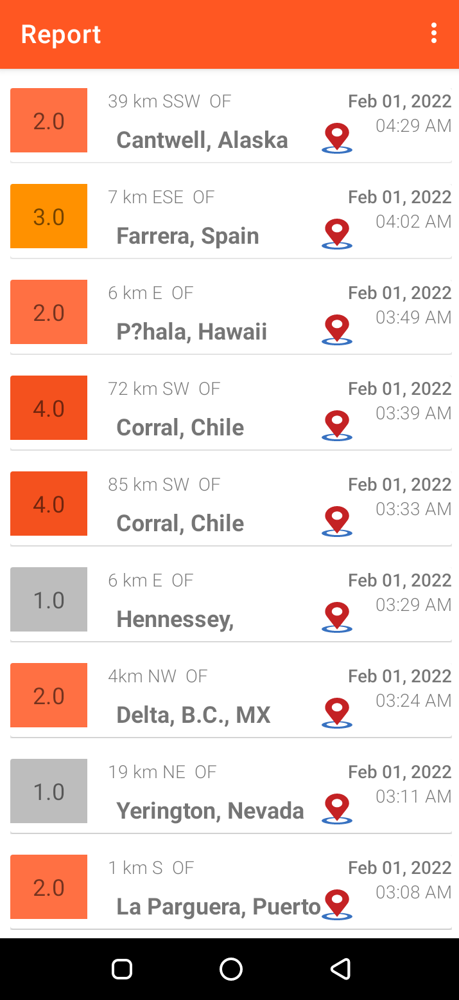

Introduction
------------

EQInfo allows you to track earthquake using information provided by USGS, You can also find the earthquake location using USGS maps

EQInfo is a core java app that uses java code to handle networking process and data transfer as well as data parsing,
Alo uses java concurrent to handle background work and offline cache mode on android.

Note : the app made for java only usecase rather than using third party libraries.

Get application demo : 

License
-------
 Copyright 2021 Muhammed Ali Ammar

   Licensed under the Apache License, Version 2.0 (the "License");
   you may not use this file except in compliance with the License.
   You may obtain a copy of the License at

       http://www.apache.org/licenses/LICENSE-2.0

   Unless required by applicable law or agreed to in writing, software
   distributed under the License is distributed on an "AS IS" BASIS,
   WITHOUT WARRANTIES OR CONDITIONS OF ANY KIND, either express or implied.
   See the License for the specific language governing permissions and
   limitations under the License.
